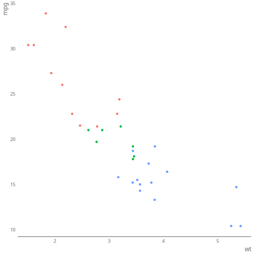
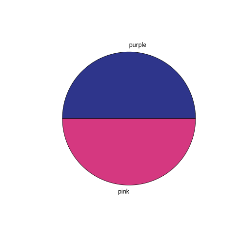
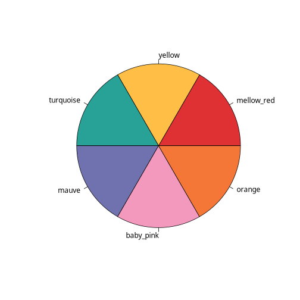
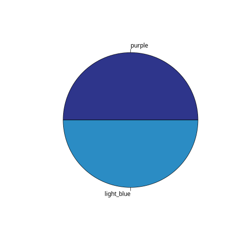
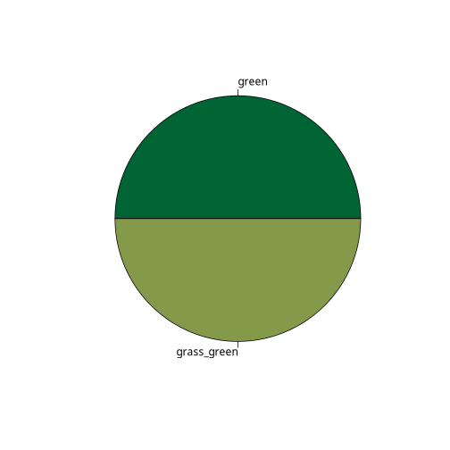

[](https://waffle.io/ukgovdatascience/govstyle)
[](https://travis-ci.org/ukgovdatascience/govstyle)
[](https://ci.appveyor.com/project/ivyleavedtoadflax/govstyle/branch/master)
[](http://codecov.io/github/ukgovdatascience/govstyle?branch=master)
[]()

# govstyle

A package for applying a [gov.uk](http://govuk-elements.herokuapp.com/) style to plots created in the R package [ggplot2](https://github.com/hadley/ggplot2).
This package *is in an early stage of development*; the intended end point is that it should be fully compliant with the gov.uk style guide.

This package turns plots from this: 


to this:


The best source of docmentation is the [vignettes](https://github.com/ukgovdatascience/govstyle/blob/master/vignettes/absence_statistics.md).
 
## Installation

To install, the package `devtools` is required, and can be installed with `install.packages('devtools')`.

`govstyle` can then be installed using `devtools::install_github('ukgovdatascience/govstyle')`.
Some users may not be able to use the `devtools::install_github()` commands as a result of network security settings.
If this is the case, `govstyle` can be installed by downloading the [zip of the repository](https://github.com/ukgovdatascience/govstyle/archive/master.zip) and installing the package locally using `devtools::install_local(<path to zip file>)`.

For testing purposes (not general usage), the package `visualTest` is required.
This can be installed with `devtools::install_github('mangothecat/visualTest')`.
For some users `devtools::install_local()` may also be required.

+You can create a development environment with `packrat` by running
+`source("packrat/init.R")` in a console, which will install `packrat` if
+necessary, and then all the packages defined in `/packrat/packrat.lock`.
+
## Functions

* `theme_gov()`: Theme to be applied to plots produced in [ggplot2]() to give a government statistics publication feel.
* `gov_cols`: A vector of the [gov.uk](http://govuk-elements.herokuapp.com/colour/#colour-extended-palette) extended palette.
* `check_pal()`: Display the extended gov.uk palette in a pie chart.

## Examples

See [Vignette](https://github.com/ukgovdatascience/govstyle/blob/master/vignettes/absence_statistics.md) for in depth usage examples.

### theme_gov


```r
library(ggplot2)
library(dplyr)
#devtools::install_github("ukgovdatascience/govstyle")
library(govstyle)
```


```r
p <- mtcars %>%
  ggplot +
  aes(
    x = wt,
    y = mpg,
    col = factor(cyl)
    ) +
  geom_point()

p
```


```r
p +
  theme_gov()
```



### check_pal


```r
## Show gov.uk colours

check_pal()
```


```r
## Show a subset of gov.uk colours

## Choose n colours:

check_pal(2)
```



```r
check_pal(3)
```


```r
check_pal(4)
```


```r
## Pick a range of colours

check_pal(3:8)
```



```r
check_pal(c(1,10))
```



```r
## Pick colours manually

check_pal(
  x = gov_cols[c("green", "grass_green")]
  )
```


